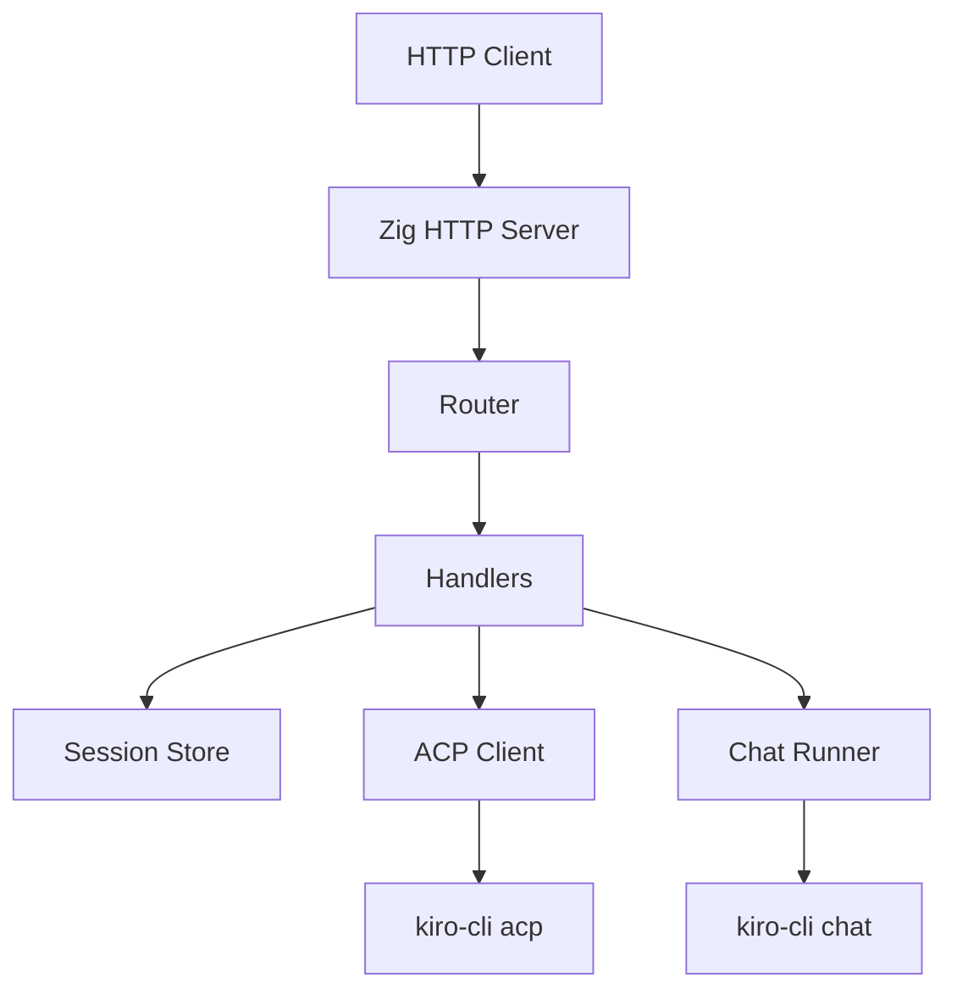

# 设计说明：Kiro CLI Zig REST API（双通道架构）

## 1. 设计原则

本设计遵循三个原则：

1. 先忠实，再优化。
2. 服务端是协议适配层，不是新的 Agent 运行时。
3. ACP 与 Chat 的差异应体现在内部模块，而不是暴露给 HTTP 客户端。

## 2. 源码基线理解

### 2.1 原文意图

官方文章说明的重点不是“如何写一个 HTTP 服务”，而是：

- 如何把 `stdio` 型 AI CLI 包装成程序可调用服务
- 如何处理 ACP 的异步 JSON-RPC over stdio
- 如何在 ACP 不支持模型切换时，引入 Chat 降级通道

### 2.2 Python 参考实现的职责分工

根据文章和 `kiro-acp` 参考源码，两个核心文件的职责如下：

- `acp_client.py`
  - 启动并持有 `kiro-cli acp`
  - 完成 `initialize`
  - 创建会话 `session/new`
  - 发送 prompt `session/prompt`
  - 读取 `_read_loop`
  - 收集 `session/update` 文本块
  - 自动回复 `session/request_permission`
  - 用 `Event + pending map` 将异步协议封装成同步调用语义

- `server.py`
  - 提供 REST API
  - 选择 ACP 或 Chat 通道
  - 维护活跃会话集合
  - 清洗 `kiro-cli chat` 的终端输出

### 2.3 哪些内容是“已知”，哪些只是“待实现设计”

以下内容视为已知：

- 存在 ACP 与 Chat 两条路径
- ACP 负责多轮会话
- Chat 负责显式模型
- `session/update` 承载正文
- `session/request_permission` 必须及时响应

以下内容属于 Zig 实现设计，不应误写成原文事实：

- Zig 模块文件名
- 内部 waiter 结构形式
- session store 的具体字段布局
- 日志字段命名
- 子进程 timeout 和重试策略

## 3. Zig 目标架构

### 3.1 模块划分

建议将 Zig 实现划分为以下模块：

- `src/types.zig`
  - 公共数据结构
  - HTTP 请求/响应 DTO
  - Session / ACP message / model metadata

- `src/acp/transport.zig`
  - `kiro-cli acp` 子进程管理
  - stdin/stdout/stderr 管道
  - JSON-RPC 消息收发

- `src/acp/client.zig`
  - ACP 客户端高层语义
  - `initialize`
  - `session/new`
  - `session/prompt`
  - `session/request_permission` 自动审批
  - `session/update` 文本收集

- `src/chat/runner.zig`
  - `kiro-cli chat` 子进程执行
  - 指定模型运行
  - stdout 清洗

- `src/store.zig`
  - 活跃会话内存存储
  - 会话元数据
  - ACP session_id 与本地 REST session_id 映射

- `src/router.zig`
  - HTTP 路由分发

- `src/handlers.zig`
  - REST 接口行为

- `src/server.zig`
  - TCP/HTTP 生命周期

- `src/main.zig`
  - CLI 参数
  - 服务启动

### 3.2 顶层组件关系



## 4. 关键行为设计

### 4.1 路由与通道选择

#### `POST /prompt`

语义：

- 若 `model == auto`，走 ACP
- 否则走 Chat

注意：

- 这是无会话快捷调用
- 对调用方隐藏内部通道差异

#### `POST /sessions`

语义：

- 仅创建 ACP 会话
- 默认模型固定为 `auto`
- 返回本地 session 标识

原因：

- 原文明确指出，只有 ACP 支持多轮上下文
- Chat 通道不应伪装成真实会话

#### `POST /sessions/{id}/prompt`

语义：

- 仅对 ACP 会话发送后续 prompt
- 通过 REST session id 找到 ACP session id

#### `GET /sessions`

语义：

- 列出当前内存态活跃 ACP 会话

#### `DELETE /sessions/{id}`

语义：

- 删除本地会话记录
- 若 ACP 协议后续支持显式关闭，可追加对应调用
- 若 Python 参考实现没有显式关闭能力，则首版 Zig 不强行发明关闭 RPC

#### `GET /models`

语义：

- 返回 REST 服务支持的模型视图
- 必须明确：
  - `auto` -> ACP
  - 其他模型 -> Chat

#### `GET /`

语义：

- 健康检查

### 4.2 ACP 客户端设计

#### 4.2.1 进程模型

ACP 使用单个长生命周期子进程：

- 启动命令：`kiro-cli acp`
- 通信方式：JSON-RPC 2.0 over stdio
- stdout：协议消息
- stderr：持续排空并记录，避免死锁

#### 4.2.2 同步语义封装

由于 ACP 底层是异步消息流，需要在 Zig 中建立：

- 自增请求 id
- `pending` 映射：`id -> waiter`
- 后台读循环
- 请求完成通知机制

Zig 中不要求一比一复制 Python 的 `threading.Event`，但必须保留同等语义：

- 请求发送后阻塞等待
- 收到带相同 `id` 的响应后唤醒

可选实现：

- `std.Thread`
- `std.Thread.Mutex`
- `std.Thread.Condition`
- 每请求一个 waiter struct

这里的实现细节是 Zig 化选择，不是原文要求。原文真正要求的是“把异步 ACP 封装成 REST 可用的同步语义”。

#### 4.2.3 文本收集

必须保持与原文一致：

- `session/prompt` 的最终 `result` 不含正文
- 正文来自多个 `session/update`
- 以 `session_id` 为键缓存文本块
- 收到 `stopReason=end_turn` 后拼接输出

建议结构：

```text
session_updates: HashMap(session_id -> ArrayList(chunk))
```

#### 4.2.4 权限审批

`session/request_permission` 必须同步回复，否则 ACP 请求会永久挂起。

首版行为：

- 默认自动返回 `allow_always`

后续可扩展：

- 配置为 `allow_once`
- 回调式审批
- 审批日志

### 4.3 Chat 通道设计

Chat 通道用于显式模型调用：

- 启动命令基于 `kiro-cli chat`
- 每请求新起一个子进程
- 不复用上下文

注意：

- 具体命令参数必须以参考实现和目标环境中的 `kiro-cli --help`/真实运行结果为准
- 设计文档不应提前写死未经验证的 CLI flag 组合

#### 4.3.1 输出清洗

必须保留原文中的清洗意图：

1. 去除 ANSI 转义码
2. 跳过 banner / 提示框 / Model/Plan 行
3. 识别有效回答正文
4. 去掉 credits/footer

这部分建议独立成纯函数，方便测试：

- 输入：原始 stdout
- 输出：清洗后的正文

### 4.4 Session Store 设计

Store 不应该伪造 Chat 多轮历史，而应明确只保存 ACP 会话：

建议结构：

```text
RestSession {
  rest_session_id: string
  acp_session_id: string
  created_at: int64
  last_used_at: int64
  mode: "auto"
}
```

`/sessions` 接口只面向 ACP 会话。

这是行为约束，不要求必须使用本文示例中的字段名；字段名可以根据 Zig 代码风格调整。

### 4.5 配置设计

建议支持以下启动参数：

- `--host`
- `--port`
- `--kiro-cli-path`
- `--workspace-dir`
- `--default-timeout-ms`
- `--permission-mode`

其中：

- `default_model` 不应误导为任意模型默认值
- `sessions` 的默认模式应固定为 `auto`

## 5. 错误处理设计

### 5.1 ACP 错误

需区分：

- 子进程未启动
- 握手失败
- 请求超时
- 协议响应缺失
- permission 请求未处理
- stdout/stderr 管道异常

### 5.2 Chat 错误

需区分：

- 命令不存在
- 非零退出码
- 输出清洗后为空
- 超时

### 5.3 HTTP 错误映射

建议：

- 400：参数无效
- 404：session 不存在
- 409：重复会话或状态冲突
- 500：内部错误
- 502：Kiro CLI / ACP 子进程异常
- 504：等待 Kiro 超时

## 6. 并发与生命周期

### 6.1 首版并发策略

ACP 通道首版按单连接顺序处理：

- 简化协议状态管理
- 与原文“单 ACP 连接”的已知限制一致

Chat 通道可天然并发，因为是单次子进程。

### 6.2 生命周期

- 服务启动时：
  - 初始化日志
  - 初始化 HTTP 服务
  - 延迟创建 ACP 子进程，或启动即创建

- 服务关闭时：
  - 关闭 ACP 子进程
  - 回收 session store
  - flush logs

## 7. 与原文一致、但可优化的点

以下点允许优化，但不能改动原始行为语义：

1. 用 Zig 的纯函数测试覆盖 chat 输出清洗。
2. 用结构化日志替代 Python 的简单 print/logging。
3. 用更严格的类型表达 JSON-RPC 消息。
4. 将 ACP transport 与 client 分层，便于后续支持更多 ACP agent。

## 8. 不应做的“优化”

以下行为虽然看似更方便，但会偏离原文意图，因此首版不做：

1. 不把 Chat 通道伪装成多轮 session。
2. 不把 `model != auto` 强行塞进 ACP。
3. 不把 REST session 和 Chat 子进程历史混成一套状态模型。
4. 不在没有证据的情况下发明新的返回格式字段。

## 9. 开发顺序建议

建议大模型按以下顺序开发：

1. 固化原文与 Python 基线约束
2. 数据结构与配置
3. Chat 通道真实执行 + 输出清洗
4. HTTP `/prompt` + `/models` + `/`
5. ACP transport
6. ACP client：`initialize`、`session/new`、`session/prompt`
7. Session store + `/sessions/*`
8. 权限自动审批 + stderr 排空 + timeout
9. 测试、文档、运行说明
